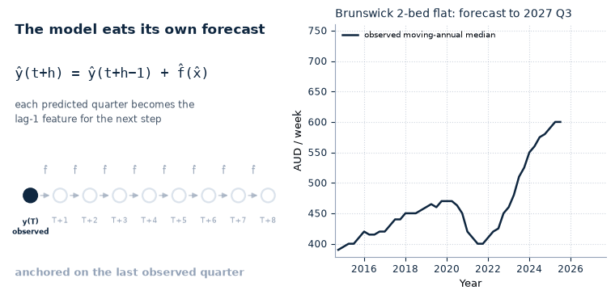

# vic-rent-ml

Open-source forecasting of Victorian **suburb-group moving-annual median weekly rents**.

This repository is the standalone machine-learning package behind that work: the training code, the temporal bake-off, a fitted model you can run locally, and a research write-up of why the pipeline is built this way.

It forecasts a published market statistic, not the rent of an individual listing.

| | |
|---|---|
| **Winner** | Huber regression on the quarterly change in the median, with postcode features (`huber_delta@location`) |
| **Validation MAE** | $23.80 / week across eight recursive horizons |
| **Held-out audit MAE** | $14.87 / week on 2025 Q1–Q3 |
| **Beats persistence by** | 11.7% on that audit window |
| **Anchor** | Trained through **2025 Q3**; forecasts **2025 Q4 through 2027 Q3** |

Read the [research paper (PDF)](docs/vic-rent-ml-paper.pdf) — [markdown source](docs/RESEARCH_PAPER.md) — for the reasoning, protocol, and numbers. Read [how it works](docs/HOW_IT_WORKS.md) for a shorter walkthrough, or see the [poster](docs/figures/poster.png) for the one-page summary.



## Quick start

Python 3.10+ (3.12 recommended to load the shipped artifact).

```sh
python -m venv .venv
source .venv/bin/activate
pip install -e ".[dev]"
```

### 1. Get a forecast from the shipped model

```sh
python examples/predict.py
```

That prints the Brunswick (`3056`) 2-bedroom-flat forecast for 2026 Q3, including the empirical error band. On the shipped artifact this is **$616.41 / week** with an 80th-percentile band of about ±$68. Or serve HTTP:

```sh
vic-rent-ml serve --model artifacts/production_clone.joblib --port 8000
```

```sh
curl -X POST http://127.0.0.1:8000/predict \
  -H 'Content-Type: application/json' \
  -d '{"postcode":"3056","apartment_type":"flat","bedrooms":2,"year":2026,"quarter":3}'
```

Omit `year` and `quarter` to forecast the next quarter after the artifact's data anchor.

### 2. Run the pipeline on synthetic data (seconds)

No government files required:

```sh
python examples/quickstart.py
```

This runs the same selection rule on a tiny synthetic panel and prints a recursive forecast.

### 3. Reproduce the published bake-off (minutes)

```sh
vic-rent-ml train --panel data/rent_panel.csv --out artifacts/production_clone.joblib --reuse-selection
```

`--reuse-selection` refits the published winner after checking that the panel, training source, and evaluation plan still match. Drop the flag to re-score all 26 candidates from scratch (several minutes).

From an official Homes Victoria workbook instead of the bundled CSV:

```sh
vic-rent-ml ingest --rent path/to/moving-annual-rent.xlsx --out data/rent_panel.csv
vic-rent-ml train --panel data/rent_panel.csv --out artifacts/production_clone.joblib
```

Workbooks: [Homes Victoria moving-annual rents by suburb](https://discover.data.vic.gov.au/dataset/rental-report-quarterly-moving-annual-rents-by-suburb).

## What the model actually predicts

Homes Victoria publishes, each quarter, the median of new rental bonds in the **12 months ending that quarter**, for a named **suburb group** (often several suburbs) and dwelling (`flat`/`house` × 1–4 bedrooms).

The model estimates the next values of that series. It does **not** estimate advertised listing prices, individual leases, or whether a rent is “fair”.

## Why this recipe

1. **Predict the change, then add last quarter's median.** Nominal rent levels trend; trees in particular cannot extrapolate a rising level. Modelling `Δmedian` keeps the problem closer to stationary.
2. **Do not use lease counts as features.** Future bond volumes are unknown at forecast time. Using them in training (or faking `count=50` at serve time) is train/serve skew.
3. **Compare every family on the same recursive protocol.** Linear models, tree ensembles, XGBoost, and two persistence baselines all forecast 1–8 quarters ahead by feeding predictions back into lags. There is no “trees must beat linear by 5%” override.
4. **Select on validation only.** The 2025 window is an audit, not a leaderboard. Residual bands are 80th-percentile walk-forward absolute errors, not a fixed ±8%.

The measured winner in this release is a **Huber regressor** with year, quarter, bedrooms, lag-1, lag-4, dwelling type, and representative postcode.

## Repository layout

```text
src/vic_rent_ml/     Ingest, bake-off, training, recursive forecast, FastAPI serving
tests/               Leakage, selection-reuse, and serving checks
data/                Bundled panel and source CSVs (see docs/DATA.md)
artifacts/           Fitted schema-2 joblib plus selection/audit files
docs/RESEARCH_PAPER.md      Paper source; docs/vic-rent-ml-paper.{tex,pdf} are built from it
docs/figures/poster.png     One-page model + output summary
docs/figures/explainer.gif  Short animation of the recursive forecast mechanism
docs/HOW_IT_WORKS.md
docs/build/          Scripts that regenerate the analyses, figures, paper, and visuals
docs/results/        Compact published metrics
examples/            Local predict and synthetic quickstart
notebooks/           Same bake-off as the CLI
```

## Rebuild the paper and the visuals

```sh
pip install -e ".[docs]"
python docs/build/analysis.py             # cluster bootstrap, reproduction, deployment forecasts
python docs/build/evaluation_illusions.py # shuffled vs temporal vs recursive scoring
python docs/build/figures.py              # paper figures + LinkedIn social card
python docs/build/explainer.py            # poster.png + explainer.gif
python docs/build/paper.py                # docs/vic-rent-ml-paper.{tex,pdf}
```

`paper.py` translates the markdown to LaTeX and compiles it with the first TeX engine on `PATH` — [Tectonic](https://tectonic-typesetting.github.io/) (single binary, recommended), XeLaTeX, LuaLaTeX or pdfLaTeX; `TEX_ENGINE` overrides the lookup. Every number in every artefact is read from `docs/results/`; nothing is hand-typed. Publishing notes are in [docs/PUBLISHING.md](docs/PUBLISHING.md).

## Tests

```sh
pytest -q tests
flake8 src tests --max-line-length=120
vic-rent-ml check-regression --manifest artifacts/manifest.json --threshold-mae 20
```

Load joblib files only from this repository or another publisher you trust. Pin the versions in `requirements-model.txt` when loading the shipped artifact.

## Licence

Code is [MIT](LICENSE). The bundled rental tables are Homes Victoria / Residential Tenancies Bond Authority data; DataVic labels that source [CC BY 4.0](https://creativecommons.org/licenses/by/4.0/). Attribution and hash details are in [docs/DATA.md](docs/DATA.md).
