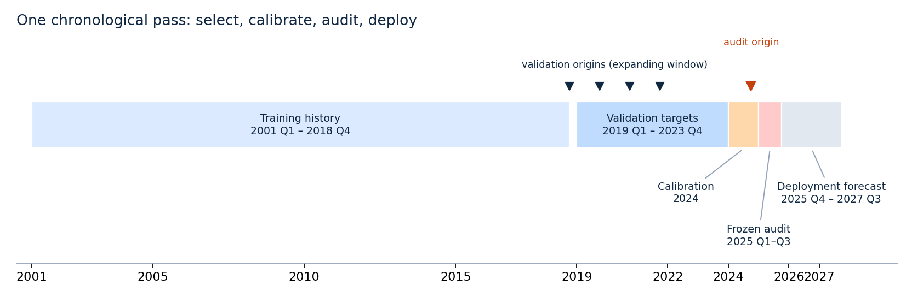
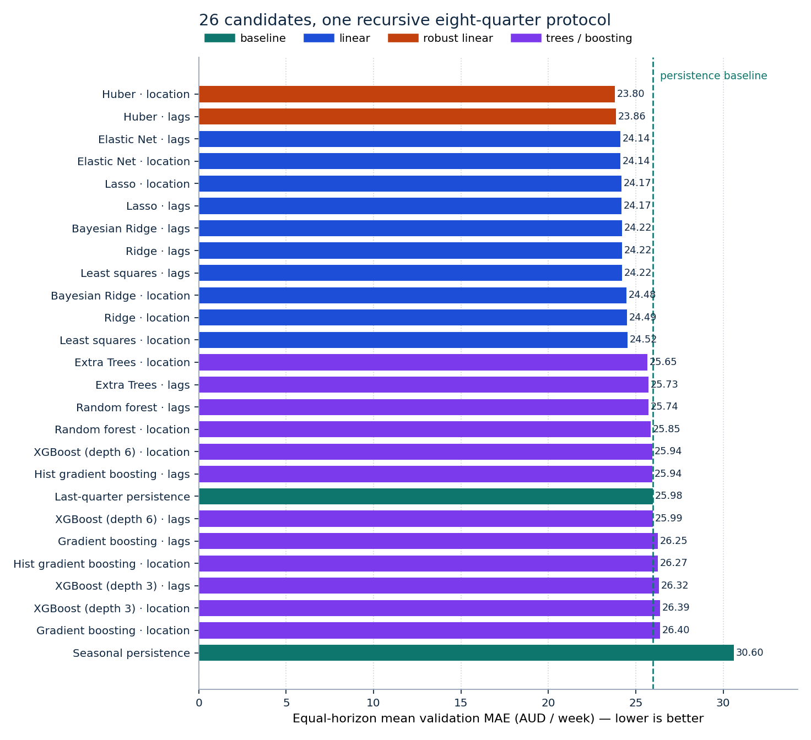
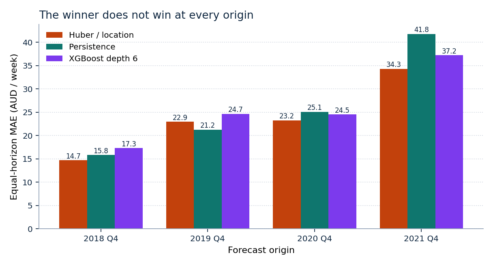
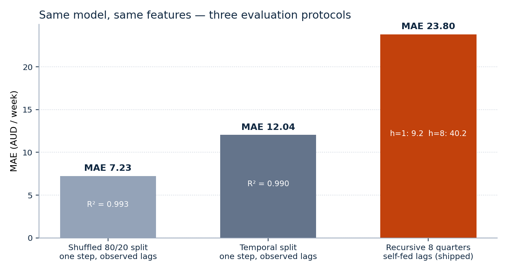
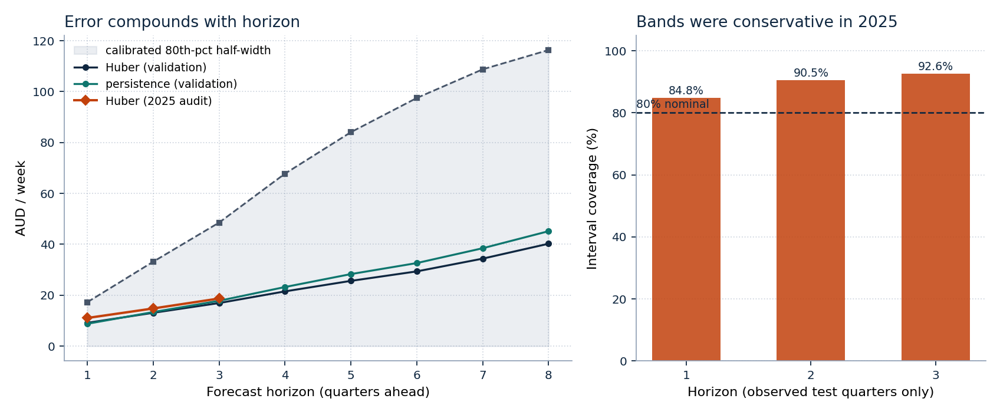
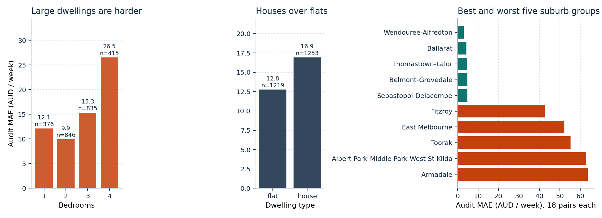
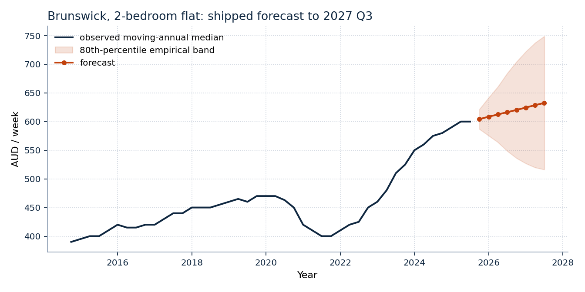

# Fair temporal model selection for Victorian rental medians

**Author:** Kelvin Valani  
**Repository:** [github.com/kelvinvalani/vic-rent-ml](https://github.com/kelvinvalani/vic-rent-ml)  
**Units:** Australian dollars per week throughout  
**Data:** Homes Victoria Rental Report (RTBA bond lodgements), 2001 Q1 – 2025 Q3

## Abstract

We compare 24 learned forecasting configurations and two persistence baselines for
Victorian suburb-group moving-annual median rents. Every candidate is scored under one
recursive temporal protocol: expanding-window origins, eight-quarter forecasts that feed
their own predictions back into lag features, and a single pre-registered objective. No
family is preferred and no tree-over-linear hurdle is applied.

Huber regression on quarterly changes with postcode categories wins with equal-horizon
validation MAE **23.80**, against **25.94** for the best tested XGBoost configuration and
**25.98** for last-quarter persistence. The frozen winner is then audited once on
2025 Q1–Q3: MAE **14.87** versus **16.85** for persistence, an **11.74%** reduction. A
suburb-group cluster bootstrap puts the audit gap at **1.98** (95% interval
**1.45 – 2.49**) AUD/week, so the ranking is stable to resampling whole suburb groups —
while remaining a statement about this panel, not a guarantee for the next regime.

The same estimator and features score **7.23** MAE under a shuffled 80/20 split and
**12.04** under a one-step temporal split. The protocol, not the algorithm, drives most of
the apparent accuracy in this problem class; we report the **23.80** figure because it is
the only one that matches what the shipped artifact actually does.

These results concern aggregate rent medians, not individual property valuations, and do
not establish that linear models generally outperform gradient boosting.

## 1. Initial thinking

The project began with a specific suspicion rather than a model wish-list. Rental
dashboards routinely quote \(R^2 > 0.99\) on suburb rent data. That number is almost
always an artifact: last quarter's median explains nearly all of this quarter's median, so
any model that is shown the true previous value looks excellent. The starting question was
therefore not *which algorithm is best?* but *what is the smallest honest number this
problem admits, and does any learned model beat doing nothing?*

Four hypotheses were written down before the bake-off was run.

| # | Starting hypothesis | Outcome |
|---|---|---|
| H1 | Persistence will be a hard baseline, because the target is a smoothed moving-annual median. | **Supported.** Persistence (25.98) still beats 6 of the 24 learned configurations, including four boosting variants. |
| H2 | Gradient boosting will win, as it usually does on tabular panels. | **Not supported here.** The best XGBoost variant scores 25.94, behind all twelve linear and robust-linear configurations. |
| H3 | Level-targeted trees will clip during a boom, because a tree cannot extrapolate beyond its training leaves. | **Supported**, and pre-empted by modelling the change rather than the level. |
| H4 | Most of the measured accuracy will come from the evaluation protocol, not the estimator. | **Strongly supported** (Section 7.2): the same model spans 7.23 → 23.80 MAE across three protocols. |

H2 failing is the interesting result, and it is reported as an outcome of *this* specified
grid on *this* target — not as a general claim about boosting. H4 is why the paper spends
more space on the protocol than on the estimator.

## 2. Target and source data

Homes Victoria publishes the Rental Report from Residential Tenancies Bond Authority bond
records. The target is the **moving-annual median weekly rent**, indexed by suburb group,
dwelling type and bedroom count. Consecutive quarters describe overlapping annual windows.
That smooths the series, induces strong serial dependence, and is precisely why
recent-rent baselines must be taken seriously.

This run uses the historical transformed CSV bundled in `data/`. A fresh official workbook
download is a different experiment; the bundled extraction has not been reconciled
cell-by-cell against the current published workbook. This is a reproducible re-analysis of
the repository data, not a claim to use the newest published file.

After requiring observed rents and exact calendar lag-1 and lag-4 values, the panel
contains **82,025 rows**, **862 dwelling series** and **146 suburb groups**, spanning
**2001 Q1 – 2025 Q3**, with **142 observed representative postcodes**. The source's
`CBD-St Kilda Rd` group has **297 rows without a postcode**; these keep an explicit missing
category and remain addressable by group name. Bedroom categories 1–4 are supported;
unsupported combinations are refused rather than assigned invented rents.

Lag construction joins series by exact quarter offsets — a gap is never treated as one
quarter merely because two rows are adjacent. Duplicate series-quarter keys, nonpositive
rents and nonfinite required values are rejected. Scoring uses series observed at each
origin whose future outcome exists; suppressed, missing or newly appearing series simply do
not contribute. All errors carry equal row weight within a horizon: lease-count weighting
answers a different, transaction-weighted question.

## 3. Formal setup

### 3.1 Notation

Let \(s\) index a series (suburb group × dwelling type × bedrooms) and \(t\) a quarter,
encoded as \(t = 4\,\text{year} + \text{quarter}\). Write \(y_{s,t}\) for the observed
moving-annual median weekly rent and \(x_{s,t}\) for the feature vector available at the
*end* of quarter \(t-1\):

\[
x_{s,t} = \big(\text{quarter}(t),\ \text{year}(t),\ \text{bedrooms}_s,\ y_{s,t-1},\ y_{s,t-4},\ \text{dwelling}_s,\ [\,\text{postcode}_s\,]\big),
\]

where the bracketed postcode term is present only in the `location` feature variant.

### 3.2 Delta-innovation target

Learned candidates predict the quarterly change rather than the level:

\[
\Delta_{s,t} = y_{s,t} - y_{s,t-1}, \qquad
\hat{y}_{s,t} = y_{s,t-1} + \hat{f}\!\left(x_{s,t}\right),
\]

so last-quarter persistence is the *nested* model \(\hat f \equiv 0\), and every learned
candidate is measured against the question "can you improve on predicting no change?".

### 3.3 Recursive forecasting

At forecast origin \(T\), horizons \(h = 1,\dots,H\) (with \(H = 8\)) are produced by
feeding predictions back into the lag state:

\[
\hat{y}_{s,T+h} = \hat{y}_{s,T+h-1} + \hat{f}\!\left(\hat{x}_{s,T+h}\right),
\qquad \hat{y}_{s,T} \equiv y_{s,T},
\]

where \(\hat x_{s,T+h}\) uses \(\hat y_{s,T+h-1}\) as lag-1 and \(\hat y_{s,T+h-4}\) as
lag-4 (falling back to \(y_{s,T}\) when an exact older lag is missing). No realised rent
after \(T\) enters any feature. This is exactly the computation the shipped artifact
performs, which is the point: the evaluation and the product run the same code path.

### 3.4 Scoring

With \(\mathcal{P}_h\) the set of forecast/outcome pairs at horizon \(h\):

\[
\mathrm{MAE}_h = \frac{1}{|\mathcal{P}_h|}\sum_{(s,t)\in\mathcal{P}_h}\left|\hat{y}_{s,t}-y_{s,t}\right|,
\qquad
\mathrm{RMSE}_h = \sqrt{\frac{1}{|\mathcal{P}_h|}\sum_{(s,t)\in\mathcal{P}_h}\left(\hat{y}_{s,t}-y_{s,t}\right)^{2}} .
\]

The selection score is the **equal-horizon mean**

\[
\overline{\mathrm{MAE}} = \frac{1}{H}\sum_{h=1}^{H}\mathrm{MAE}_h ,
\qquad
\overline{\mathrm{RMSE}} = \frac{1}{H}\sum_{h=1}^{H}\mathrm{RMSE}_h ,
\]

*not* a pooled average over all pairs and *not* the square root of pooled MSE. Pooling
would let horizon 1 dominate simply because more of its outcomes are observable, quietly
rewarding models that are good at the easy horizon. Ties in \(\overline{\mathrm{MAE}}\) go
to \(\overline{\mathrm{RMSE}}\), then to the candidate identifier, so selection is
deterministic.

### 3.5 Uncertainty bands

After the winner is frozen, each horizon's band half-width is the 80th percentile of
absolute calibration-window error:

\[
w_h = Q_{0.80}\Big(\big\{\,|\hat{y}_{s,t}-y_{s,t}| : (s,t)\in\mathcal{C}_h\,\big\}\Big),
\qquad
\text{band}_h = \left[\hat{y}_{s,T+h}-w_h,\ \hat{y}_{s,T+h}+w_h\right],
\]

with \(\mathcal{C}_h\) the 2024 calibration pairs. These are empirical, symmetric and
purely historical — not a parametric predictive distribution, and not a claim about the
spread of individual property rents.

## 4. Design decisions and what each one costs

Every choice below was made *before* the audit window was touched. The right-hand column is
the price paid for it, which is the part usually omitted.

| Decision | Alternative rejected | Why | What it costs |
|---|---|---|---|
| Predict \(\Delta\), anchor on \(y_{t-1}\) | Predict the level directly | Nominal rents trend; tree ensembles cannot emit a level above their highest training leaf and clip after a boom | Errors accumulate along the recursion; a biased \(\hat f\) drifts |
| Recursive eight-quarter scoring | One-step-ahead scoring | Production never has the realised lag-1 for horizon 5 | Roughly halves the headline accuracy (Section 7.2) |
| Expanding-window origins | Random 80/20 split | Overlapping moving-annual windows put the same information on both sides of a shuffle | Far fewer scored pairs; the pipeline refuses a panel that ends at the test origin |
| Equal-horizon mean | Pooled mean over all pairs | Stops horizon 1 dominating the ranking | Later, noisier horizons have more influence on selection |
| Two persistence baselines eligible to win | Learned-model-only shortlist | If nothing beats "no change", that is the finding | Risks shipping a baseline — accepted |
| Exclude `lease_count` | Use it, or impute a dummy at serving | Future lease counts do not exist; training on them is train/serve skew | Loses a genuinely informative historical signal |
| Exclude macro / amenity features | Add RBA, CPI, amenity snapshots | An eight-quarter forecast would need an invented exogenous path; amenity snapshots are not vintage-safe | No policy-scenario capability |
| Postcode as a category (`location` variant) | Suburb-group one-hot, or embeddings | Coarse geography, few parameters, degrades gracefully on unseen values | Only a 0.06 AUD/week gain — kept for interpretability, not demonstrated skill |
| Huber loss \((\epsilon = 1.35)\) | Squared loss | Quarterly changes have heavy tails (regime shifts, small-sample groups) | Slightly biased under genuinely Gaussian noise |
| Freeze the winner before the audit | Re-rank all candidates on 2025 | Prevents the audit from becoming a second selection round | The audit says nothing about non-winning candidates |
| Refit the *exact* selected pipeline on all data | Retrain a "similar" model for production | Eliminates selection/deployment mismatch | Refit coefficients are not the ones validated |

## 5. Candidates

Ordinary least squares, Ridge (\(\alpha = 10\)), Lasso (\(\alpha = 0.1\)), Elastic Net
(\(\alpha = 0.1\), `l1_ratio` 0.5), Huber (\(\epsilon = 1.35\), 2000 iterations), Bayesian
Ridge, histogram gradient boosting (200 iterations, 15 leaves, L2 = 10), random forest and
Extra Trees (150 trees, depth 12, min leaf 10), gradient boosting (200 trees, depth 3,
learning rate 0.05), and XGBoost at depths 3 and 6 (300 trees, learning rate 0.05, min child
weight 10, L2 = 10, row/column subsample 0.8, `hist`). Each learned estimator is run under
both feature variants; randomized estimators use seed 42. Full settings are in
`docs/results/candidate_parameters.json`.

This is a finite specified grid, not exhaustive hyperparameter search — a real limitation
for the tree families, which are more tuning-sensitive than the linear ones. Numeric
imputation and scaling and categorical one-hot encoding are fitted **inside** each fold.

## 6. Temporal protocol



| Stage | Origins | Scored targets | Purpose |
|---|---|---|---|
| Validation | Expanding history ending Q4 of 2018, 2019, 2020, 2021 | Next 8 quarters per origin, no later than 2023 Q4 | Choose the candidate |
| Calibration | Expanding origins 2022 Q1 – 2024 Q3 | Targets in 2024 only, horizons 1–8 | Fit band half-widths |
| Frozen audit | One origin, 2024 Q4 | Available 2025 Q1–Q3 outcomes | Audit winner vs baselines |
| Deployment refit | All labelled data through 2025 Q3 | Forecasts to 2027 Q3 | Serve the selected pipeline |

All 26 candidates see the same **26,651** validation forecast/outcome pairs, and no
convergence warnings were recorded. Test metrics never enter the ranking. Only three test
horizons are observable, so this experiment provides **no final-test result for horizons
4–8** — the bands at those horizons are calibrated but unaudited.

The chronological partition blocks direct future-target leakage. It is *not* a full
vintage simulation: quarter-end reference dates are used as availability dates, so
publication delay and retrospective revision remain unmodelled.

## 7. Results

### 7.1 Validation selection



Best feature variant per family (the full 26-row ranking is in
`docs/results/bakeoff_metrics.csv`):

| Candidate | Features | Validation MAE | Validation RMSE |
|---|---|---:|---:|
| **Huber** | **location** | **23.80** | **37.22** |
| Elastic Net | lags / location tie | 24.14 | 37.45 |
| Lasso | lags / location tie | 24.17 | 37.40 |
| Bayesian Ridge | lags | 24.22 | 37.53 |
| Ridge | lags | 24.22 | 37.53 |
| Ordinary least squares | lags | 24.22 | 37.53 |
| Extra Trees | location | 25.65 | 39.82 |
| Random forest | lags | 25.74 | 40.35 |
| XGBoost, depth 6 | location | 25.94 | 40.85 |
| Histogram gradient boosting | lags | 25.94 | 40.68 |
| Last-quarter persistence | — | 25.98 | 39.44 |
| Gradient boosting | lags | 26.25 | 40.00 |
| XGBoost, depth 3 | lags | 26.32 | 40.31 |
| Seasonal persistence | — | 30.60 | 45.19 |

Huber improves on persistence by **8.40%**. Adding postcode moves Huber only from
**23.857** to **23.799** — a descriptive difference of 0.06 AUD/week, not evidence of a
reliable location effect. The rule nevertheless selects the lower score, exactly as it
would have for a similarly small tree advantage.



| Origin | Huber/location MAE | Persistence MAE | XGBoost depth-6/location MAE |
|---|---:|---:|---:|
| 2018 Q4 | 14.70 | 15.81 | 17.31 |
| 2019 Q4 | 22.95 | **21.25** | 24.66 |
| 2020 Q4 | 23.24 | 25.05 | 24.53 |
| 2021 Q4 | 34.27 | 41.77 | 37.21 |

The winner does not beat persistence at every origin. Strong persistence plus strong robust
linear performance is consistent with a smooth target and heavy-tailed changes; Huber's
reduced outlier sensitivity is a plausible explanation, not a causal finding.

### 7.2 The protocol, not the model, sets the headline



Holding the estimator and features fixed and changing only the evaluation protocol
(`docs/build/evaluation_illusions.py`):

| Protocol | MAE | Level \(R^2\) | Pairs |
|---|---:|---:|---:|
| Shuffled 80/20 split, one step, observed lags | 7.23 | 0.9934 | 15,239 |
| Temporal split, one step, observed lags | 12.04 | 0.9895 | 6,708 |
| **Recursive 8 quarters, self-fed lags (shipped)** | **23.80** | — | 26,651 |

A shuffled split lets overlapping moving-annual windows and neighbouring quarters of the
same series appear on both sides of the partition; one-step scoring hands the model an
observed lag it will never have at horizon 5. Either choice would have made this project
look three times better and would have been wrong. Within the recursive protocol, error
grows from **9.16** at \(h=1\) to **40.24** at \(h=8\) — an honest description of how far
ahead this target is actually predictable.

### 7.3 Frozen-winner audit

| Model | Test MAE | Test RMSE | Pairs |
|---|---:|---:|---:|
| **Huber/location** | **14.87** | **28.19** | 2,472 |
| Last-quarter persistence | 16.85 | 29.51 | 2,472 |
| Seasonal persistence | 34.30 | 45.17 | 2,472 |

These are equal-horizon averages over the **three** observable test horizons, so they are
not comparable with the eight-horizon validation average; the audit window is also simply
calmer than 2021–22. The winner was frozen before this audit and no other candidate was
re-ranked on it.



| Horizon | Test pairs | MAE | Empirical half-width | Observed coverage |
|---|---:|---:|---:|---:|
| 1 quarter | 829 | 11.07 | 17.29 | 84.80% |
| 2 quarters | 822 | 14.82 | 33.19 | 90.51% |
| 3 quarters | 821 | 18.73 | 48.56 | 92.57% |
| 4 quarters | not observed | — | 67.78 | — |
| 5 quarters | not observed | — | 84.07 | — |
| 6 quarters | not observed | — | 97.50 | — |
| 7 quarters | not observed | — | 108.75 | — |
| 8 quarters | not observed | — | 116.33 | — |

Coverage exceeds the nominal 80% at every observed horizon, which says the 2024
calibration errors were conservative for this particular 2025 period — not that coverage
is guaranteed in the next regime.

### 7.4 How much of the gap is sampling noise?

Rows are not independent: 2,472 audit pairs come from 829 series inside only 146 suburb
groups. Treating them as independent would overstate precision. We therefore resample
**whole suburb groups** with replacement (2,000 draws, seed 42, `docs/build/analysis.py`),
recomputing the equal-horizon MAE gap between the winner and persistence on each draw.

| Window | Pairs | Winner MAE | Persistence MAE | Gap | 95% cluster-bootstrap interval | Draws favouring winner | Series won |
|---|---:|---:|---:|---:|---|---:|---:|
| Validation (2019 Q1 – 2023 Q4) | 26,651 | 23.80 | 25.98 | **2.18** | [1.60, 2.79] | 100% | 64.6% |
| Frozen audit (2025 Q1 – Q3) | 2,472 | 14.87 | 16.85 | **1.98** | [1.45, 2.49] | 100% | 63.2% |

The interval excludes zero in both windows and no bootstrap draw reverses the ranking, so
the advantage is not an artifact of a few influential suburb groups. Two caveats keep this
honest: the interval describes resampling variability of the *measured* gap on this panel,
not out-of-sample performance under a regime change; and the winner still loses on ~36% of
individual series.

### 7.5 Where the error actually lives



Pooled audit MAE is **12.77** for flats and **16.90** for houses, and rises from **9.94**
for two-bedroom to **26.50** for four-bedroom dwellings — thin, expensive, volatile slices
are the hard ones. Armadale reaches MAE **63.64** on only 18 pairs; Albert Park–Middle
Park–West St Kilda **62.87** and Toorak **55.31** on the same slice size. Average
performance conceals substantial local error, and these per-group figures are too small to
support significance claims of their own.

### 7.6 What the shipped model actually forecasts



For Brunswick two-bedroom flats (anchor 600 AUD/week at 2025 Q3), the refit model forecasts
604 AUD/week for 2025 Q4 (band 587–622) and 633 for 2027 Q3 (band 516–749). The point path
is close to a gentle linear rise; the honest content of the forecast is the band, which
nearly quadruples in width over eight quarters. Full per-series forecasts are in
`docs/results/deployment_forecasts.csv`.

## 8. What this model does not do

- It does **not** value individual properties. The bands describe the error of a
  *group median*, and must never be read as the range containing 80% of individual rents.
- It does **not** establish that linear models beat gradient boosting in general — only
  that in this grid, on this target, under this protocol, they did.
- It does **not** explain *why* rents move. There are no causal claims; postcode and
  bedroom effects are associations within a specific forecasting pipeline.
- It has **no audited accuracy beyond three quarters ahead**. Horizons 4–8 ship with
  calibrated but unverified bands.
- It assumes the measurement process is stable. A change in RTBA lodgement coverage,
  suppression rules or the moving-annual definition would break the lag relationships the
  model relies on, silently.
- It carries no vintage realism: revisions and publication delays are not simulated.

## 9. Open gaps and the next experiment

1. **Vintage-correct data.** Reconstruct the as-published series with real availability
   dates, then re-run the protocol. This is the single biggest credibility gap.
2. **An independent eight-horizon audit.** Requires roughly five more quarters of
   outcomes; until then horizons 4–8 are unverified.
3. **A real tuning budget for the tree families**, using validation data only. The current
   grid is fixed and arguably under-serves boosting.
4. **Quantile or conformal intervals** instead of symmetric empirical half-widths, which
   cannot express asymmetric downside risk in falling markets.
5. **Hierarchical pooling** across suburb groups, targeted at the thin four-bedroom and
   high-price slices where error concentrates.
6. **Drift monitoring in production**: compare realised quarters against the shipped bands
   and alert when observed coverage departs from nominal.

## 10. Reproducibility

`vic-rent-ml train` freezes the winner identifier, calibrates bands, audits the test window
against persistence, and refits the exact selected pipeline on all labelled quarters. The
schema-2 artifact stores the fitted estimator, origin history, precomputed recursive
forecasts, residual widths, winner, evaluation plan, dependency versions and data digests.
Saved-selection reuse (`--reuse-selection`) fails if validation data, training source or
evaluation settings change. Serving reads artifact history rather than fabricating amenity
values or lease counts. Postcodes that map to more than one source group return an
aggregated, flagged forecast; unsupported combinations fail instead of inventing a rent.

```sh
python -m venv .venv && source .venv/bin/activate
pip install -r requirements-model.txt
pip install -e ".[dev]"
vic-rent-ml train --panel data/rent_panel.csv --out artifacts/production_clone.joblib --reuse-selection
python docs/build/analysis.py              # bootstrap intervals + deployment forecasts
python docs/build/evaluation_illusions.py  # protocol comparison
python docs/build/figures.py               # all figures in docs/figures/
python docs/build/paper.py                 # docs/vic-rent-ml-paper.pdf
```

The published artifact run used Python **3.12.3**, NumPy **2.4.6**, pandas **3.0.6**,
scikit-learn **1.9.1**, XGBoost **3.4.1**, joblib **1.6.0**; `manifest.json` records model
SHA-256 `5839b40f1c04ae6646b178e66f21a5dc34742fb801459cb7c744afbe9afac56d`. The analyses in
Sections 7.2 and 7.4 were re-run independently on Python 3.10.12 with NumPy 2.2.6, pandas
2.3.3, scikit-learn 1.7.2 and XGBoost 3.2.0, reproducing the published audit MAE of
14.871824 to seven significant figures (`docs/results/reproduction.json`). Only load
trusted joblib artifacts with compatible dependencies.

## References and attribution

1. Homes Victoria, [Rental Report — Quarterly: Moving Annual Rents by Suburb](https://discover.data.vic.gov.au/dataset/rental-report-quarterly-moving-annual-rents-by-suburb).
   DataVic identifies the source licence as Creative Commons Attribution 4.0 International;
   retain Homes Victoria attribution when redistributing its data.
2. Hyndman and Athanasopoulos, [Forecasting: Principles and Practice — Time series cross-validation](https://otexts.com/fpp3/tscv.html).
3. Huber (1964), Robust Estimation of a Location Parameter, *Annals of Mathematical Statistics* 35(1), 73–101.
4. Efron (1979), Bootstrap Methods: Another Look at the Jackknife, *Annals of Statistics* 7(1), 1–26; cluster variant per Cameron, Gelbach and Miller (2008).
5. scikit-learn, [HuberRegressor](https://scikit-learn.org/stable/modules/generated/sklearn.linear_model.HuberRegressor.html) and [Common pitfalls](https://scikit-learn.org/stable/common_pitfalls.html).
6. Chen and Guestrin (2016), [XGBoost: A Scalable Tree Boosting System](https://doi.org/10.1145/2939672.2939785).
